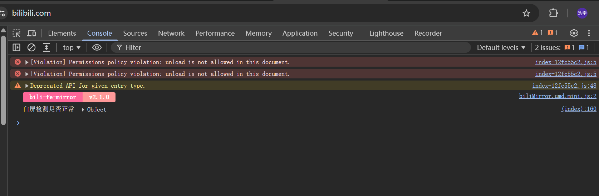
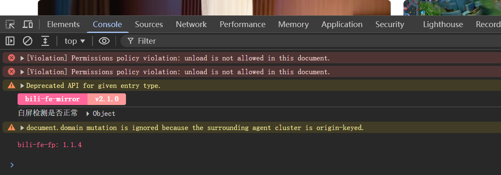
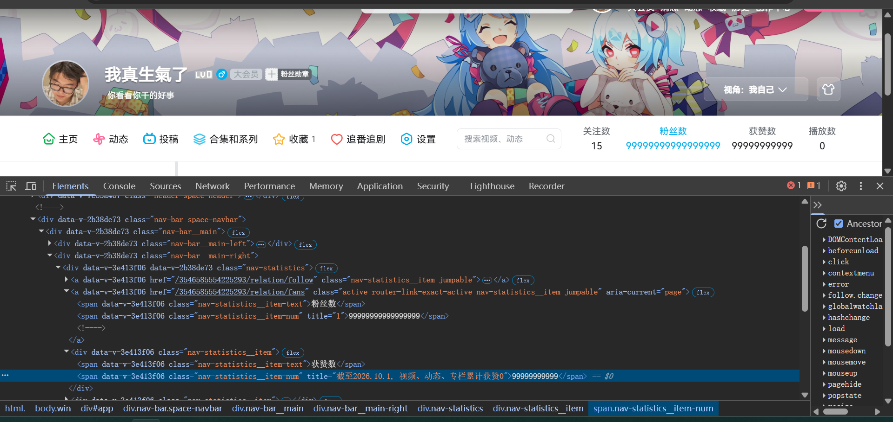
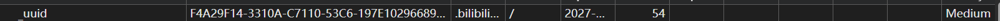
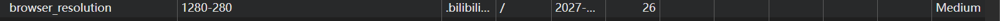
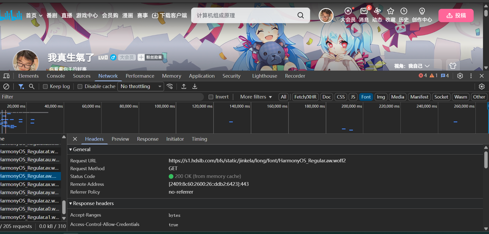
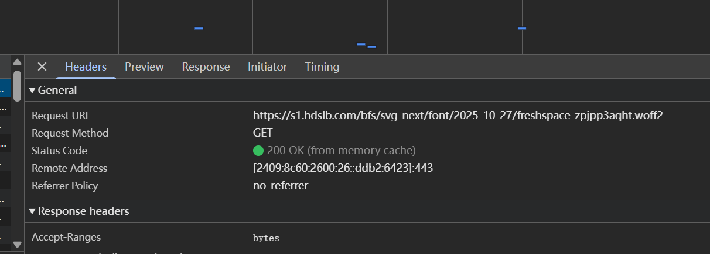
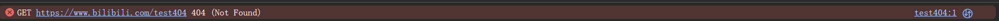

## 一、基础面板有哪些

按 F12 打开开发者工具后，顶部有一排标签，有 7 个：

| 面板 | 作用 |
| --- | --- |
| **Elements**（元素） | 可以双击直接改文字、改样式，页面立刻变化 |
| **Console**（控制台） | 执行 JS 代码，显示网页打印的日志、警告和报错 |
| **Sources**（源代码） | 查看网页的源文件，可以打断点、单步调试 JS |
| **Network**（网络） | 记录页面发出的所有请求，能看到请求方式、状态码、响应头、加载耗时 |
| **Application**（应用） | 查看和管理网页存储的数据，比如 Cookie、localStorage |
| **Performance**（性能） | 录制网页运行的过程，用来分析哪里卡顿、哪里掉帧 |
| **Lighthouse** | 自动给页面打分，检查性能、可访问性、SEO 等，并给出改进建议 |

除此之外还有 Security（安全）、Memory（内存）、Recorder（录制）等，不过用得比较少

### 我觉得哪个最有用

**我认为最有用的是 Elements 面板。**

原因有三个。

**第一，它最直观。** 改样式不用「改文件 → 保存 → 切回浏览器 → 刷新」这一圈，直接在右边改，左边立刻就能看到效果。调间距、试颜色的时候特别方便。

**第二，它显示的是浏览器真正解析出来的结构**，不是我写的源码。比如 JS 动态插入的元素，或者我标签写错了被浏览器自动纠正的地方，在这里都能看出来。光看源码是发现不了的。

**第三，排查问题快。** 它有一个盒模型图，能一眼看清 margin、padding、border 各占多少；也能看到元素上绑定了哪些事件。样式没生效的时候，在这里点一下就知道是被哪条规则覆盖掉了。

当然 Console 也很常用，报错的时候基本是第一时间去看它。但如果只能留一个，我还是选 Elements。

---

## 二、在 Elements 面板里修改页面

### 1. 修改我自己的展览馆页面

我打开第 1 题做的页面，按 F12，用 Elements 面板左上角那个小箭头选中了 `<h1>` 标题，双击「饮料大全」这几个字，改成别的内容——**页面上的标题马上就变了**，我甚至没有刷新。

接着我又在右边的 Styles 面板里给标题加了一句 `color: red;`，标题当场变红。然后我选中一个 `<p>` 段落，同样双击改了里面的文字，也立刻生效。

改完以后按 F5 刷新，**所有改动都不见了，页面完全恢复原样。**

我想了一下原因：我改的其实**只是浏览器内存里的数据**，磁盘上的 `index.html` 文件一个字都没变。刷新的时候浏览器会把内存里的东西全部丢掉，重新读取 `index.html`，重新解析、重新渲染。文件本身没变，页面自然就变回去了。

所以 Elements 面板里的修改是**临时的**，用来试验很方便，但想真正改掉，还是要回到编辑器里改文件再保存。





### 2. B 站登录后的 Console

又打开 B 站，按 F12 切到 Console，先记下没登录时有哪些输出，然后登录了自己的账号，再看一遍。

结果**只多了一行**：

```
bili-fe-fp 1.1.4
```

我原本以为会多出很多日志，结果就这么一行。想了想应该是因为线上网站一般不打印调试信息，既浪费性能又容易暴露实现细节，所以只在必要的地方留了几行。

我猜 `bili-fe-fp` 的意思是 bilibili 的前端指纹库（frontend fingerprint），`1.1.4` 是版本号。为了验证，我用 `Ctrl + Shift + F` 全局搜索了这个字符串，想找到是哪个文件打印的，结果是：__________。

### 3. 伪造暂时的百万关注和点赞

我进入自己的个人空间，用 `Ctrl + Shift + C` 选中粉丝数和点赞数，双击改成一百万，页面当场就变了。

不过这个「百万粉」只存在于我自己浏览器的内存里，B 站服务器上的真实数据一点没变，别人看到的还是原来的数字，我刷新一下也立刻打回原形——和上面改文字是同一个道理。



---

## 三、Cookie

### 1. 什么是 Cookie

Cookie 是服务器让浏览器存下来的一小段文本数据，格式就是「名字=值」。

我个人的理解是，它就像一张**身份牌**——浏览器会自动保存它，之后每次访问这个网站，都会自动把它带在请求里发过去。

### 2. 它解决了什么问题

HTTP 协议本身是「无状态」的，意思是服务器不会记得你是谁，每一次请求在它眼里都是全新的。

但实际需要的恰恰相反：登录一次之后，不该每点一个链接就被要求重新登录一次。

Cookie 就是来补这一块的。有了它，我登录之后就不用反复登录，网站也能记住我的偏好设置。

### 3. 如何查看 Cookie

我用的是 **Application 面板**：

F12 → 点顶部的 Application → 左边找到 Storage 下的 Cookies → 点开域名那一行，右边就会列出所有字段，包括名字、值、域名、路径、过期时间，还有 HttpOnly 这些属性。

另外还有两个地方也能看到：

- **Network 面板**：点开任意一条请求，Request Headers 里有一行 `Cookie`，那是实际发出去的内容
- **Console**：输入 `document.cookie` 就能打印出来，但只能看到一部分（原因见下）

### 4. 两个有意思的 Cookie 字段

#### `_uuid`



它的值是一长串编号，有效期到 2027 年。

我猜它的作用，是**在没登录的时候也能认出「这台设备来过」**。因为它不需要登录就已经存在了，所以它认的不是我的账号，而是我的设备。B 站可以用它做访问量统计、内容去重，也能判断是不是陌生设备、有没有异常行为。

我还注意到它的 Domain 是 `.bilibili.com`，前面带一个点。带点意味着**B 站的所有子域名都能用到它**，所以我从 www 跳到 space 再跳到 message，B 站都能认出是同一个人。

#### `browser_resolution`



它的值是 `1280-280`，应该表示宽 1280、高 280。
这个字段应该是记录浏览器的可视区域大小。服务器据此判断该给我哪个版本的页面（桌面版还是手机版），产品经理和设计师也能靠这份数据决定做几个断点、优先适配哪些尺寸。

#### 放在一起看

这两个 Cookie 挺有意思：`_uuid` 是服务器**随机分配**给设备的一个编号，内容本身没有任何意义；`browser_resolution` 是**从我的环境里读出来**的真实特征，内容本身带着信息。前者可以靠清除 Cookie 摆脱，后者即使清了 Cookie 也还是那个值。

### 5. 如果有人拿到我的 Cookie

后果比我想的要严重——对方可以**直接以我的身份登录**，看到我的私信、收藏夹、观看历史、关注列表、充电和购买记录，还能用我的账号发评论、发弹幕，甚至尝试改绑账号。整个过程不需要知道我的密码，因为服务器认为这就是我本人的正常会话。

不过我注意到 `SESSDATA` 这个最关键的 Cookie 是勾了 **HttpOnly** 的，所以我在 Console 里敲 `document.cookie` 是找不到它的。浏览器故意不让 JS 读到它——这样即使网页被注入了恶意脚本，也没法把它偷走。

所以平时还是要注意：别在公共电脑上勾「记住我」，用完记得退出登录，也不要随便往 Console 里粘贴别人发来的代码。

---

## 四、Network 面板

### 1. 大部分是 GET 还是 POST



刷新 B 站个人空间页之后，面板左下角显示产生了 **205 个请求**。我用 `method:POST` 过滤了一下，POST 只有 ___ 条，剩下的**绝大部分都是 GET**。

我理解的原因是：刷新页面做的事情，本质上都是「读取」——取回 HTML、CSS、JS、图片、字体，还有各种接口数据，这些都属于读取操作，所以用 GET。

而 POST 是用来提交数据、改变服务器状态的，比如登录、发评论、点赞。我只是刷新了一下页面，什么都没提交，所以 POST 很少。

### 2. 一个 200 和一个非 200 的请求

**状态码 200：**



表示请求成功，服务器正常把内容返回给了浏览器。

**状态码 404：**



这个我一开始怎么都找不到——在 B 站页面上翻了好几遍，全是 200。后来才想明白：**404 本来就是异常状态，一个正常运行中的网站不应该出现它**，出现了才说明有问题。

所以我自己造了一个：在地址栏访问 `https://www.bilibili.com/test404`，这个地址并不存在，服务器就返回了 404。

404 表示**服务器收到了请求，但是找不到这个资源**。这里要区分它和 500 的不同：

- **404** 说明服务器本身是好的，只是没有你要的东西，问题在客户端这一边（地址写错了，或者资源被删掉了）
- **500** 则是服务器自己的代码出错了，问题在服务端

### 3. Content-Type


我点开一条请求，在 Response Headers 里找到了 `Content-Type`，值是 `application/octet-stream`。

这个值的意思是「未知的二进制数据」。浏览器看到它，就**不会去解析这份内容**，而是当成一个普通文件处理（通常是下载），而不是渲染它。

作为对比，我又看了文档请求，它的 `Content-Type` 是 `text/html; charset=utf-8`，浏览器就把它渲染成网页，并且按 UTF-8 解码——这也解释了第 1 题里为什么要写 `<meta charset="UTF-8">`，两者都是为了保证中文不乱码。

所以 `Content-Type` 的作用，就是告诉浏览器**这份响应是什么类型、应该怎么处理它**。同一份数据，标的类型不同，浏览器的行为完全不一样。

---

## 小结

做这一题之前，我打开 F12 基本只会看看 Console 有没有报错。做完之后才意识到，这些面板各管一摊，而且互相配合：

Elements 改的是**内存里的 DOM**，所以刷新就没了；Network 记录的是**浏览器和服务器之间的往来**；Application 管的是**存在本地的数据**；Console 则是所有信息的汇总口。

另外印象最深的是两件事：一是 Cookie 里藏着的设计取舍（`SESSDATA` 用 HttpOnly 藏起来，`bili_jct` 为了让 JS 能读取反而不能藏），二是状态码不能只看「成功」和「失败」——404 和 500 分属两端，责任完全不同。
